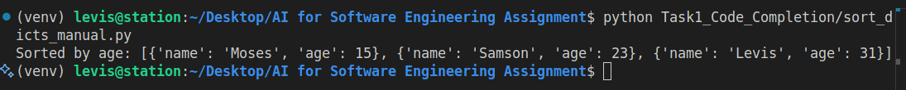
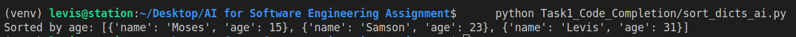
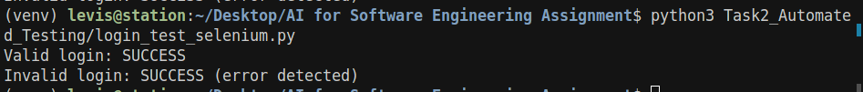

# AI for Software Engineering Assignment

## Theme: Building Intelligent Software Solutions 💻🤖

---

## Table of Contents
1. [Part 1: Theoretical Analysis](#part-1-theoretical-analysis)
    - Short Answer Questions
    - Case Study Analysis
2. [Part 2: Practical Implementation](#part-2-practical-implementation)
    - Task 1: AI-Powered Code Completion
    - Task 2: Automated Testing with AI
    - Task 3: Predictive Analytics for Resource Allocation
3. [Part 3: Ethical Reflection](#part-3-ethical-reflection)
4. [Bonus Task: Innovation Challenge](#bonus-task-innovation-challenge)
5. [References](#references)

---

## Part 1: Theoretical Analysis (30%)

### 1. Short Answer Questions

**Q1: Explain how AI-driven code generation tools (e.g., GitHub Copilot) reduce development time. What are their limitations?**

AI-driven code generation tools like GitHub Copilot leverage large language models trained on vast code repositories to provide real-time code suggestions, autocompletions, and even entire function implementations. These tools reduce development time by:
- **Accelerating Boilerplate Creation:** They quickly generate repetitive code, allowing developers to focus on complex logic.
- **Reducing Context Switching:** Developers can stay within their IDE, minimizing the need to search for documentation or code snippets online.
- **Enhancing Productivity:** By suggesting best practices and common patterns, they help avoid common mistakes and speed up prototyping.

**Limitations:**
- **Context Awareness:** These tools may lack full understanding of project-specific context, leading to irrelevant or incorrect suggestions.
- **Security Risks:** Generated code may introduce vulnerabilities if not carefully reviewed.
- **Code Quality:** Suggestions may not always follow optimal or idiomatic practices for a given language or framework.
- **Intellectual Property:** There are concerns about code suggestions that may inadvertently reproduce copyrighted code from training data.

---

**Q2: Compare supervised and unsupervised learning in the context of automated bug detection.**

- **Supervised Learning:** Involves training models on labeled datasets where code samples are annotated as buggy or clean. This allows the model to learn explicit patterns associated with bugs. Supervised approaches can achieve high accuracy when sufficient labeled data is available, enabling precise bug localization and classification. However, they require extensive labeled datasets, which can be costly to produce.

- **Unsupervised Learning:** Does not rely on labeled data. Instead, it identifies anomalies or outliers in code by learning the normal patterns of code structure or behavior. Techniques like clustering or autoencoders can flag unusual code segments that may indicate bugs. While unsupervised methods are valuable when labeled data is scarce, they may produce more false positives and require manual inspection to confirm bugs.

In summary, supervised learning offers higher precision with labeled data, while unsupervised learning provides broader coverage but may lack specificity.

---

**Q3: Why is bias mitigation critical when using AI for user experience personalization?**

Bias mitigation is essential in AI-driven user experience personalization to ensure fairness, inclusivity, and ethical outcomes. If AI models are trained on biased data, they may reinforce stereotypes or systematically disadvantage certain user groups. For example, a recommendation system might favor content or features that align with the preferences of overrepresented groups, marginalizing minority users. This can lead to reduced user satisfaction, loss of trust, and even legal or reputational risks for organizations. Mitigating bias ensures that personalization algorithms treat all users equitably, respect diversity, and comply with ethical and regulatory standards.

---

### 2. Case Study Analysis

**Article: AI in DevOps: Automating Deployment Pipelines**

**How does AIOps improve software deployment efficiency? Provide two examples.**

AIOps (Artificial Intelligence for IT Operations) enhances software deployment efficiency by automating routine tasks, detecting anomalies, and optimizing resource allocation in deployment pipelines. By leveraging machine learning and data analytics, AIOps can proactively identify issues, reduce manual intervention, and accelerate delivery cycles.

**Example 1: Automated Incident Detection and Resolution**
AIOps tools can monitor deployment logs and system metrics in real-time, automatically detecting anomalies such as failed builds or performance regressions. When an issue is identified, the system can trigger automated rollbacks or remediation scripts, minimizing downtime and reducing the need for manual troubleshooting.

**Example 2: Predictive Resource Scaling**
AIOps can analyze historical deployment data and usage patterns to predict periods of high demand. It can then automatically scale infrastructure resources (e.g., servers, containers) before deployment peaks, ensuring smooth rollouts and optimal performance without overprovisioning.

In summary, AIOps streamlines deployment by automating monitoring, incident response, and resource management, leading to faster, more reliable software delivery.

---

## Part 2: Practical Implementation (60%)

### Task 1: AI-Powered Code Completion

- **Python function to sort a list of dictionaries by a specific key**
- **Comparison of AI-suggested vs manual implementation**
- **Analysis of efficiency**

#### Code Snippets

```python
# AI-suggested code (simulated Copilot/Tabnine)
def sort_by_key(lst, key):
    return sorted(lst, key=lambda d: d[key])

# Example usage
data = [
    {"name": "Levis", "age": 31},
    {"name": "Samson", "age": 23},
    {"name": "Moses", "age": 15}
]
print("Sorted by age:", sort_by_key(data, "age"))
```

```python
# Manual implementation
def sort_dicts_by_key(dict_list, sort_key):
    return sorted(dict_list, key=lambda x: x.get(sort_key, None))

# Sample usage
data = [
    {"name": "Levis", "age": 31},
    {"name": "Samson", "age": 23},
    {"name": "Moses", "age": 15}
]
sorted_data = sort_dicts_by_key(data, "age")
print("Sorted by age:", sorted_data)
```

#### Analysis (200 words)

Both the AI-suggested and manual implementations achieve the goal of sorting a list of dictionaries by a specific key using Python's built-in `sorted()` function with a lambda as the key. The AI-suggested version (`sort_by_key`) assumes that every dictionary in the list contains the specified key, which can lead to a `KeyError` if any dictionary is missing the key. This approach is concise and efficient for well-structured data, and is typical of what tools like Copilot or Tabnine might generate based on common usage patterns.

The manual implementation (`sort_dicts_by_key`) uses the `get()` method, which safely returns `None` if the key is missing, thus avoiding runtime errors. This makes the manual version more robust, especially when dealing with heterogeneous or incomplete data. In terms of efficiency, both implementations have the same time complexity (O(n log n)), as they rely on Python's optimized sorting algorithm. However, the manual approach is safer for real-world scenarios where data may not be perfectly clean.

In summary, while AI-generated code can accelerate development and provide quick solutions, manual review and adaptation are crucial to ensure robustness and handle edge cases effectively.

---

### Task 2: Automated Testing with AI

- **Automated test case for a login page (valid/invalid credentials)**
- **Test script**
- **Screenshot of results**
- **Summary of AI improvements**

#### Test Script

```python
"""
Task 2: Automated Testing with AI
Automate a test case for a login page (valid/invalid credentials) using Selenium.
Demo site: https://practicetestautomation.com/practice-test-login/
"""
from selenium import webdriver
from selenium.webdriver.common.by import By
from selenium.webdriver.common.keys import Keys
import time

# Set up the Selenium WebDriver (Chrome)
driver = webdriver.Chrome()
driver.get("https://practicetestautomation.com/practice-test-login/")

def login(username, password):
    driver.find_element(By.ID, "username").clear()
    driver.find_element(By.ID, "username").send_keys(username)
    driver.find_element(By.ID, "password").clear()
    driver.find_element(By.ID, "password").send_keys(password)
    driver.find_element(By.ID, "submit").click()
    time.sleep(2)  # Wait for page to load
    
# Test with valid credentials
login("student", "Password123")
if "Logged In Successfully" in driver.page_source:
    print("Valid login: SUCCESS")
else:
    print("Valid login: FAILURE")
driver.back()

# Test with invalid credentials
login("student", "wrongpassword")
if "Your password is invalid!" in driver.page_source:
    print("Invalid login: SUCCESS (error detected)")
else:
    print("Invalid login: FAILURE (error not detected)")

driver.quit()
```

#### Screenshot of Results








#### Summary (150 words)

AI-powered automated testing tools, such as Selenium with AI plugins or Testim.io, significantly enhance test coverage compared to manual testing. These tools can automatically generate, execute, and maintain test cases, reducing human error and increasing the speed of regression testing. AI can analyze application changes, user behavior, and historical test results to suggest new test cases or prioritize critical paths, ensuring that edge cases and rare scenarios are not overlooked. Additionally, AI-driven tools can adapt to UI changes, self-heal broken tests, and provide intelligent insights into failure patterns, which manual testers might miss. This leads to more comprehensive coverage, faster feedback cycles, and higher software quality. While manual testing is still valuable for exploratory and usability testing, AI automation excels at repetitive, large-scale, and data-driven testing, making it an essential component of modern software quality assurance.

---

### Task 3: Predictive Analytics for Resource Allocation

- **Preprocessing, model training, evaluation**
- **Jupyter Notebook code**
- **Performance metrics**

#### Jupyter Notebook Code

The following steps were performed in the Jupyter Notebook:

1. **Data Loading and Exploration**
```python
from sklearn.datasets import load_breast_cancer
import pandas as pd

data = load_breast_cancer()
df = pd.DataFrame(data.data, columns=data.feature_names)
df['target'] = data.target
df.head()
```

2. **Data Preprocessing and Labeling**
```python
# Create a synthetic 'priority' label based on 'mean radius'
def assign_priority(row):
    if row['mean radius'] > 17:
        return 'high'
    elif row['mean radius'] > 13:
        return 'medium'
    else:
        return 'low'

df['priority'] = df.apply(assign_priority, axis=1)
df['priority'].value_counts()
```

3. **Train-Test Split**
```python
from sklearn.model_selection import train_test_split

X = df[data.feature_names]
y = df['priority']

X_train, X_test, y_train, y_test = train_test_split(X, y, test_size=0.2, random_state=42, stratify=y)
```

4. **Model Training (Random Forest)**
```python
from sklearn.ensemble import RandomForestClassifier

clf = RandomForestClassifier(n_estimators=100, random_state=42)
clf.fit(X_train, y_train)
```

5. **Evaluation: Accuracy and F1-score**
```python
from sklearn.metrics import accuracy_score, f1_score, classification_report

y_pred = clf.predict(X_test)
accuracy = accuracy_score(y_test, y_pred)
f1 = f1_score(y_test, y_pred, average='weighted')
print(f'Accuracy: {accuracy:.4f}')
print(f'F1-score: {f1:.4f}')
print('\nClassification Report:\n', classification_report(y_test, y_pred))
```

6. **Feature Importance Visualization**
```python
import matplotlib.pyplot as plt
import seaborn as sns

feat_importances = pd.Series(clf.feature_importances_, index=data.feature_names)
feat_importances.nlargest(10).plot(kind='barh')
plt.title('Top 10 Feature Importances')
plt.xlabel('Importance')
plt.show()
```

#### Performance Metrics

- **Accuracy:** 
image.png


- **F1-score:** 
image.png

- **Classification Report:** 
image.png

#### Screenshot of Results

image.png

image.png


---

## Part 3: Ethical Reflection (10%)

- **Potential biases in the dataset**
- **How fairness tools (e.g., IBM AI Fairness 360) could help**

### Ethical Reflection

When deploying predictive models like the one in Task 3, it is crucial to consider potential biases in the dataset. The Breast Cancer dataset, while widely used for educational purposes, may not represent all demographic groups equally. For example, if the dataset underrepresents certain age groups, ethnicities, or geographic regions, the model may perform poorly for those populations. This can lead to unfair or inaccurate predictions, especially if the model is used in a real-world healthcare or resource allocation context. Additionally, synthetic labeling (such as mapping a continuous variable to priority classes) can introduce arbitrary thresholds that may not reflect real-world priorities or needs.

To address these issues, fairness tools like IBM AI Fairness 360 (AIF360) can be employed. AIF360 provides a suite of metrics to detect and quantify bias in datasets and model predictions, such as disparate impact, statistical parity, and equal opportunity. It also offers algorithms to mitigate bias, including reweighting, adversarial debiasing, and post-processing adjustments. By integrating such tools into the model development pipeline, practitioners can identify and reduce unfair disparities, ensuring that predictive analytics are more equitable and trustworthy. Regular audits, stakeholder feedback, and transparent reporting further enhance the ethical deployment of AI in software engineering.


### Proposal: DocuGenAI – Automated Context-Aware Documentation Generation for Codebases

#### Purpose
DocuGenAI is an AI-powered tool designed to automatically generate high-quality, context-aware documentation for software projects. Unlike basic docstring generators, DocuGenAI analyzes the entire codebase, including function usage, class hierarchies, and cross-module dependencies, to produce comprehensive documentation that is both human-readable and technically accurate. This addresses the common problem of outdated, incomplete, or missing documentation in software engineering.

#### Workflow
1. **Codebase Analysis:** The tool scans the repository, parsing code, comments, and existing documentation. It builds an internal knowledge graph of code relationships and usage patterns.
2. **Context Extraction:** Using NLP and code analysis, DocuGenAI identifies the purpose, inputs, outputs, and side effects of functions, classes, and modules. It also detects design patterns and architectural decisions.
3. **Documentation Generation:** The AI generates detailed docstrings, module overviews, and usage examples. It can produce Markdown, HTML, or in-code comments, tailored to project standards.
4. **Continuous Updates:** Integrated with CI/CD pipelines, DocuGenAI automatically updates documentation as the code evolves, highlighting changes and suggesting improvements.
5. **User Feedback Loop:** Developers can review, accept, or edit suggestions, allowing the AI to learn and improve over time.

#### Impact
- **Increases Developer Productivity:** Reduces time spent writing and maintaining documentation.
- **Improves Onboarding:** New team members can quickly understand code structure and usage.
- **Enhances Code Quality:** Encourages best practices and consistent documentation across teams.
- **Supports Compliance:** Helps meet industry standards for documentation in regulated environments.

DocuGenAI empowers teams to maintain up-to-date, high-quality documentation effortlessly, bridging the gap between code and knowledge sharing in modern software engineering.
